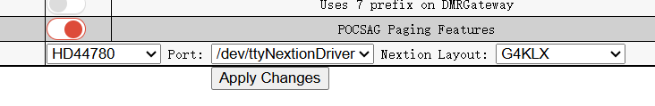
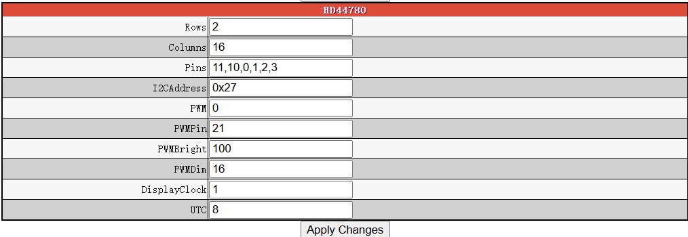
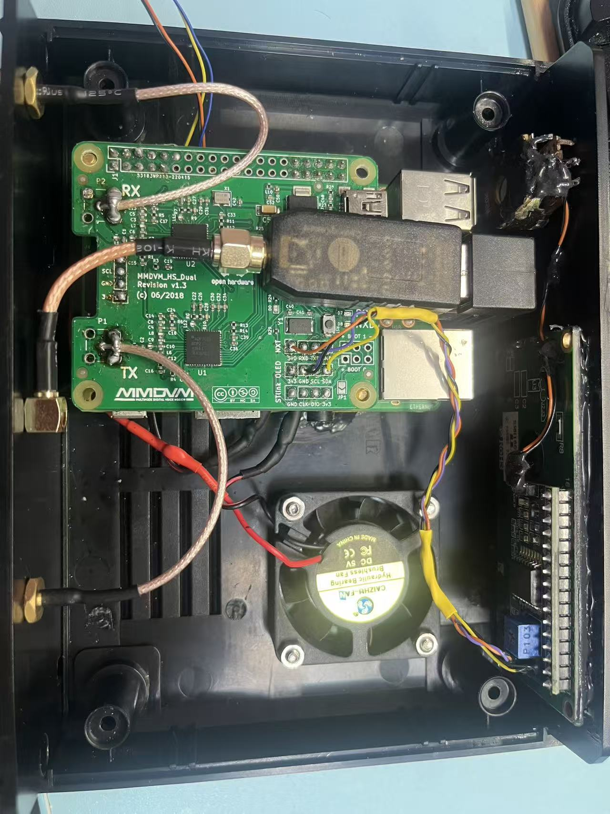
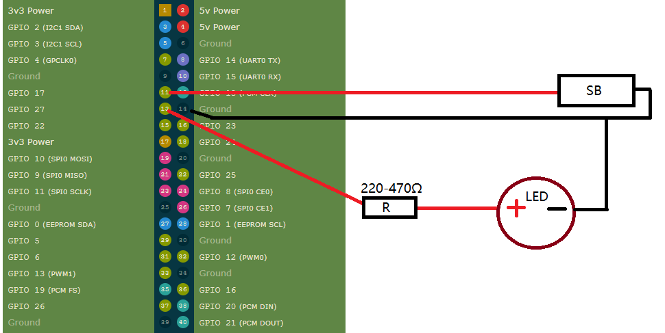
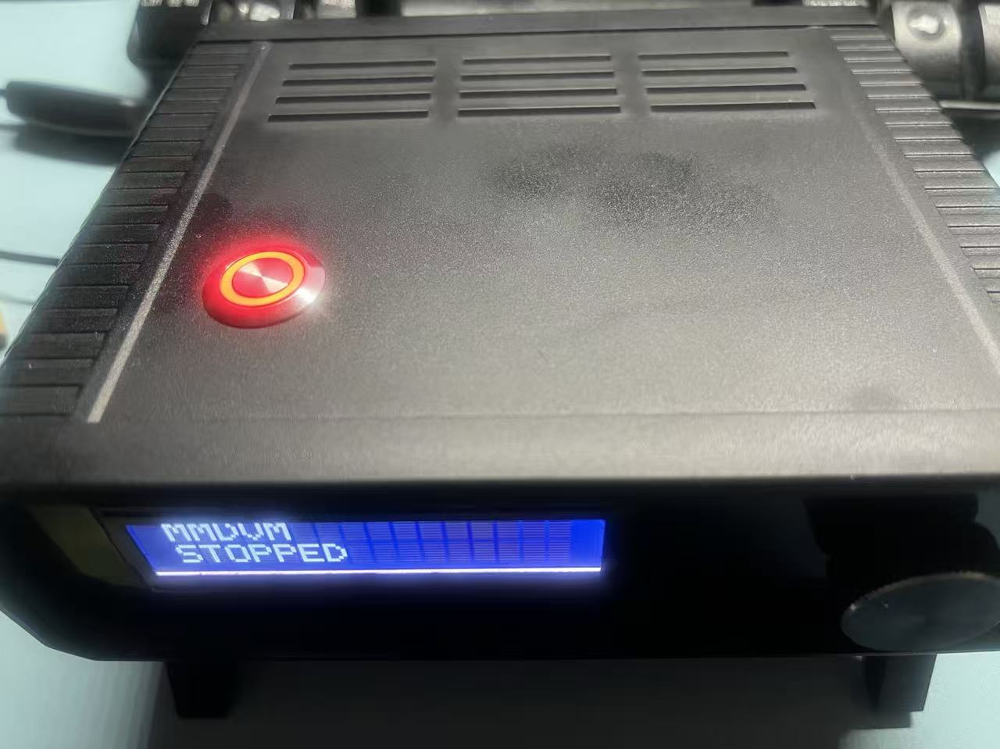

# Pi-Star ModeKey DMR / C4FM Switcher

> 一键切换 DMR 与 C4FM 模式的 Pi-Star 按键/LED/LCD 工具  
> A physical button/LED/LCD tool to switch DMR and C4FM modes on Pi-Star

---

我只有一个 Pi-Star 热点，但有两台不同模式的手台。每次切换模式都需要打开电脑或手机登录 Pi-Star 管理页面，这非常麻烦。  
Pi-Star 自带多模式守听（Mode Scanning）功能，但它更像轮询，当 DMR 频道非常热闹时，C4FM 很难得到机会。  
我希望在某个时刻可以快速切换到另一个模式，于是想有一个按键。

I only have one Pi-Star hotspot but two handheld radios with different modes.  
Switching modes requires opening a computer or mobile browser to log in to the Pi-Star dashboard every time, which is inconvenient.  
Pi-Star's Mode Scanning essentially polls different modes: when DMR traffic is heavy, C4FM rarely gets a chance.  
I wanted a simple button to quickly switch between modes whenever I need to.

---

## 硬件需求 / Hardware Requirements

- 自复位按键 (GPIO 17) = 物理引脚 11  
  / Push button (GPIO 17, physical pin 11)  
- 可选 LED (GPIO 27) = 物理引脚 13，串联电阻 220-470Ω  
  / Optional LED (GPIO 27, pin 13, series resistor 220-470Ω)  
- GND = 物理引脚 14  
  / GND (pin 14)  
- 可选 I2C LCD (连接热点板 5V, GND, SDA, SCL)  
  / Optional I2C LCD (connect to hotspot board 5V, GND, SDA, SCL)  


> **注意 / Note:** LCD 可选，安装脚本会根据选择自动安装所需依赖  
> LCD is optional. The installer script will automatically install required dependencies if you select the LCD version.


---

## 功能 / Features

- **按键切换模式 / Mode switching via a physical button**  

- **LED 状态反馈 / LED status indicator**  
  - 成功切换 C4FM：LED 长亮一次 / C4FM switch success: LED lights up for ~2 seconds  
  - 成功切换 DMR：LED 快速闪烁 5 次 / DMR switch success: LED flashes quickly 5 times  

- **可选 LCD 显示 / Optional I2C LCD display**  

- **安全修改 Pi-Star 配置 / Safely modify Pi-Star settings without affecting other configurations**  

- **systemd 自启服务 / systemd auto-start service**  

- **心跳灯显示当前模式 / Heartbeat LED shows active mode**  
  - 每隔约 10 秒闪烁一次 / Flashes every ~10 seconds  
    - DMR: 单次微闪 / single blink  
    - C4FM: 双次微闪 / double blink



---

## 安装 / Installation

1. 切换到主目录（可选） / Go to home directory (optional):
```bash
cd ~
确保 Pi-Star 已切换到读写模式 / Make sure Pi-Star is in read-write mode:

sudo pistar-rw
克隆仓库 / Clone repository:

git clone https://github.com/nakai1234567/pi-star-modekey-dmr-c4fm
cd pi-star-modekey-dmr-c4fm
给安装脚本可执行权限 / Make installer executable:

chmod +x install.sh
运行安装脚本 / Run installer:

sudo ./install.sh
安装时会提示选择 无 LCD 版本 或 LCD 版本。
The installer will ask whether to install the No LCD version or the LCD version.

提示 / Reminder: 如果安装过程中出现权限问题，请确保使用 pistar-rw 并以 sudo 运行安装脚本。
Reminder: If you encounter permission issues during installation, make sure Pi-Star is in read-write mode (pistar-rw) and run the installer with sudo.

卸载 / Uninstall
chmod +x uninstall.sh
sudo ./uninstall.sh
